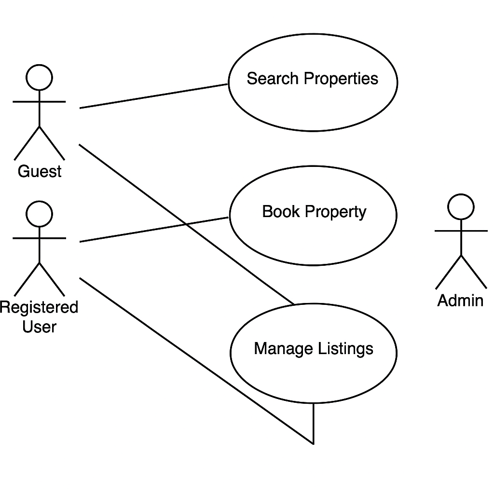

# Requirement Analysis in Software Development

The Requirement Analysis Project focuses on crafting a comprehensive foundation for software development by documenting, analyzing, and structuring requirements. This project simulates a real-world development scenario, emphasizing clarity, precision, and structure in defining requirements to set the stage for successful project execution.

---

## What is Requirement Analysis?

Requirement Analysis is a critical phase in the software development lifecycle (SDLC) where the project team gathers, analyzes, and defines the requirements of the software product to be developed. This process ensures that all stakeholders have a clear and mutual understanding of what the system should do and how it should perform.

---

## Why is Requirement Analysis Important?

- **Clarity and Understanding**: Helps understand stakeholder expectations, reducing ambiguity.
- **Scope Definition**: Clearly defines the project scope, preventing scope creep.
- **Basis for Design and Development**: Provides a foundation for system design and implementation.
- **Cost and Time Estimation**: Facilitates accurate estimates for cost, resources, and timeline.
- **Quality Assurance**: Ensures the final product meets requirements and satisfies users.

---

## Key Activities in Requirement Analysis

### 1. Requirement Gathering 🗂️

- **Interviews**: Talk with stakeholders to understand their needs.
- **Surveys/Questionnaires**: Collect input from a broader audience.
- **Workshops**: Group sessions for in-depth discussions.
- **Observation**: Watch end-users interact with current systems.
- **Document Analysis**: Study existing systems and documentation.

### 2. Requirement Elicitation ✍️

- **Brainstorming**: Generate and collect ideas.
- **Focus Groups**: Gather detailed feedback from selected stakeholders.
- **Prototyping**: Create mockups to refine requirements.

### 3. Requirement Documentation 📚

- **Requirement Specification Document**: Comprehensive list of all functional and non-functional requirements.
- **User Stories**: Describe features from a user's perspective.
- **Use Cases**: Show how users interact with the system.

### 4. Requirement Analysis and Modeling 📊

- **Requirement Prioritization**: Sort by importance and impact.
- **Feasibility Analysis**: Check if the requirements are technically and financially feasible.
- **Modeling**: Use diagrams (DFDs, ERDs) to visualize requirements.

### 5. Requirement Validation ✅

- **Review and Approval**: Stakeholder validation of documented requirements.
- **Acceptance Criteria**: Define measurable success for each feature.
- **Traceability**: Ensure all requirements are linked throughout development.

---

## Types of Requirements

### Functional Requirements ⚙️

> Describe **what** the system should do.

**Examples for Booking System:**
- **Search Properties**: Search by location, price, and availability.
- **User Registration**: Create account with personal details.
- **Property Listings**: Show details and images.
- **Booking System**: Manage bookings, view history.
- **User Authentication**: Secure login and access control.

### Non-functional Requirements 🛡️

> Describe **how** the system performs.

**Examples:**
- **Performance**: Load pages in under 2 seconds; support 1000+ users.
- **Security**: Data encryption and secure login processes.
- **Scalability**: Handle increased traffic with horizontal scaling.
- **Usability**: Easy-to-navigate UI.
- **Reliability**: 99.9% uptime and fast recovery.

---

## Use Case Diagrams 📊

Use case diagrams provide a visual representation of how users interact with the system to accomplish tasks.

### What are Use Case Diagrams?

- Illustrate relationships between users (actors) and system functionalities (use cases).
- Useful for identifying and organizing system requirements.
- Improve stakeholder communication.

### Example Actors and Use Cases:
- **Actors**: Guest, Registered User, Admin.
- **Use Cases**: Search Property, Book Property, Manage Listings.

### Diagram:

---

## Acceptance Criteria ✅

Acceptance criteria define the conditions that must be met for a feature to be considered complete.

### How to Define Acceptance Criteria:

- Be **specific** and **measurable**.
- Cover **functional** and **non-functional** aspects.

**Example (Booking System):**
> "Users should be able to select available dates, confirm booking, and receive a confirmation email within 2 minutes."

### Benefits:

- Ensure shared understanding of feature requirements.
- Support testing and validation.
- Improve quality assurance and user satisfaction.

---
